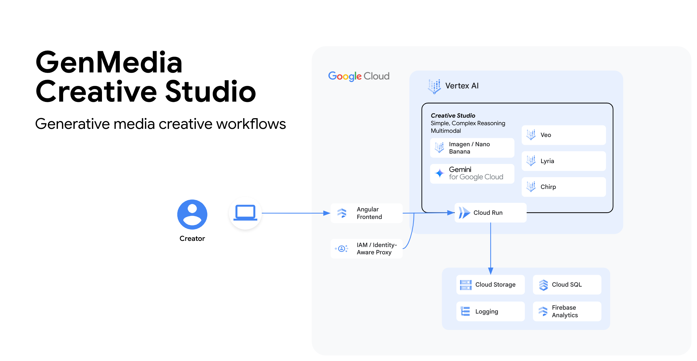
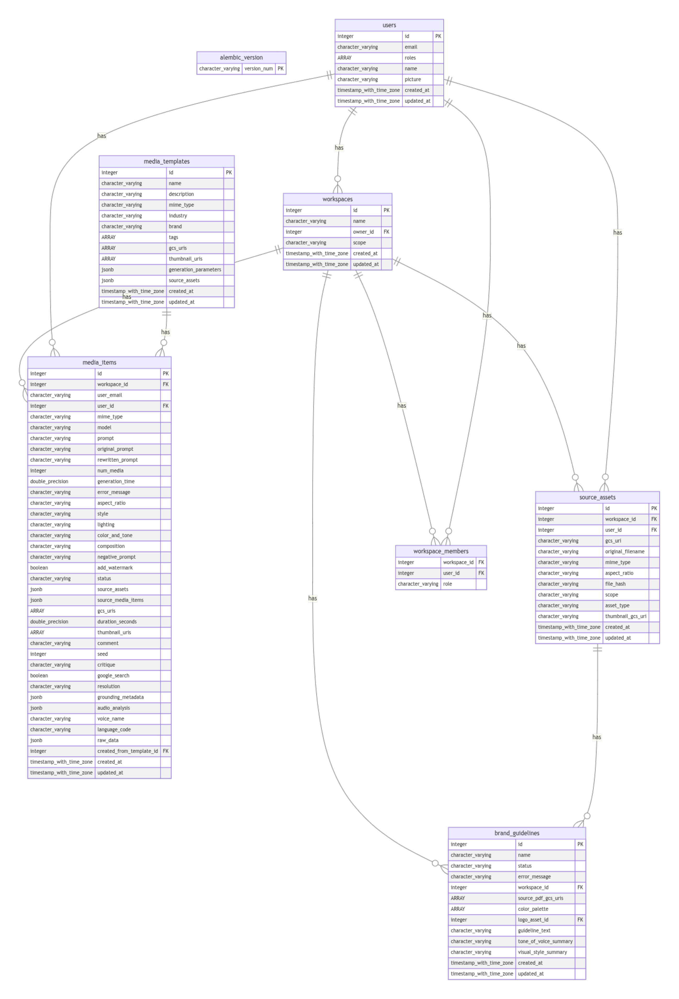

# Google Cloud Creative Studio Platform | Backend

## System Architecture and DB Schema



The backend follows a **Modular, Feature-Driven Architecture**, heavily inspired by the principles of Hexagonal Architecture (Ports & Adapters).

* **Structure:** Code is organized by feature domain (e.g., /images, /galleries, /users) rather than by technical layer (/controllers, /services).  
* **Rationale:**  
  * **Scalability:** This approach prevents individual directories from becoming unwieldy as the application grows.  
  * **Maintainability:** All code related to a single feature is co-located, making it easier to understand, modify, and test.  
  * **High Cohesion, Low Coupling:** Modules are self-contained and interact through well-defined interfaces (services and DTOs), making the system robust and flexible.

### Technology Stack

| Category | Technology / Service |
| :---- | :---- |
| **Frontend** | Angular, TypeScript, Angular Material, Tailwind CSS |
| **Backend** | Python, FastAPI, Pydantic |
| **Database** | Google Cloud SQL (PostgreSQL) |
| **Cloud Provider** | Google Cloud Platform (GCP) |
| **Deployment** | Cloud Run (for backend), Firebase Hosting (for frontend) |
| **AI Models** | Imagen, Veo, Gemini (via Vertex AI SDK) |

## 🚀 Backend Setup

To run the backend locally using Docker Compose, you need to configure the environment variables.

### 1. Configure `.env` file

Create a `.env` file in the `backend/` directory with the following content (replace values with your specific configuration):

```bash
# Common env vars
FRONTEND_URL="http://localhost:4200"
ENVIRONMENT="local"
LOG_LEVEL="INFO"

# Project ID: creative-studio-deploy
GOOGLE_CLOUD_PROJECT="creative-studio-deploy"
PROJECT_ID="creative-studio-deploy"
GENMEDIA_BUCKET="creative-studio-deploy-cs-development-bucket"
SIGNING_SA_EMAIL="cs-development-read@creative-studio-deploy.iam.gserviceaccount.com"
GOOGLE_TOKEN_AUDIENCE="XXXX-XXXXXXXXXXX.apps.googleusercontent.com"
IDENTITY_PLATFORM_ALLOWED_ORGS=""
```

### 2. Running the Application

We use Docker Compose to run the application locally. Please refer to the [Root README](../README.md#4-running-with-docker-compose) for detailed instructions on how to start the services.

If you want to start just the backend you can run the following command:

```bash
docker compose up backend
```

The backend will be available at `http://localhost:9000`.

### 3. Local Authorization (OpenFGA)

To enable fine-grained authorization locally using OpenFGA:

1.  **Start the services:**
    ```bash
    docker compose up
    ```

    The backend will automatically:
    *   Connect to the local OpenFGA service.
    *   Create the "Creative Studio" store if it doesn't exist.
    *   Configure the Authorization Model.
    *   Set the `OPENFGA_STORE_ID` for the current session.

    **Note:** You do NOT need to manually configure `OPENFGA_STORE_ID` in `.env` for local development anymore, as it's handled automatically on startup.

You can access the OpenFGA Playground at [http://localhost:3000/playground](http://localhost:3000/playground).

## Code Styling & Commit Guidelines

To maintain code quality and consistency:

* **Python (Backend):** We adhere to the [Google Python Style Guide](https://google.github.io/styleguide/pyguide.html), using tools like `pylint` and `black` for linting and formatting.

### Backend (Python with `pylint` and `black`)

1.  **Ensure Dependencies are Installed:**
    Add `pylint` and `black` to your `backend/requirements.txt` file:
    ```
    pylint
    black
    ```
    Then install them within your virtual environment:
    ```bash
    pip install pylint black
    # or pip install -r requirements.txt
    ```
2.  **Configure `pylint`:**
    It's recommended to have a `.pylintrc` file in your `backend/` directory to configure `pylint` rules. You might need to copy a standard one or generate one (`pylint --generate-rcfile > .pylintrc`).
3.  **Check for linting issues with `pylint`:**
    Navigate to the `backend/` directory and run:
    ```bash
    pylint .
    ```
    (Or specify modules/packages: `pylint your_module_name`)
4.  **Format code with `black`:**
    To automatically format all Python files in the current directory and subdirectories:
    ```bash
    python -m black . --line-length=80
    ```

## 🔐 OpenFGA Authorization Model

This section details the Types, Relations, and Inheritance rules defined in our OpenFGA store.

### 1. The Hierarchy (Inheritance Flow)

The power flows downwards. If you have a role at the top, you inherit permissions below.

```mermaid
graph TD
    Platform[Platform (Super Admin)] -->|Inherits| OrgOwner[Organization (Owner)]
    OrgOwner -->|Inherits| OrgAdmin[Organization (Admin)]
    OrgAdmin -->|Inherits| WS[Workspace (Admin)]
    WS -->|Inherits| Asset[Asset (Edit/View)]
```

### 2. Type Definitions & Permissions

#### A. Platform (`platform`)
The root level singleton.
*   **Object ID**: `platform:creative-studio`
*   **Relations**:
    *   `super_admin`: The "God Mode" role. Has full access to everything.
        *   *Capabilities*: Can manage all organizations, workspaces, and users. Can change their own role and transfer ownership.

#### B. Organization (`organization`)
Represents a tenant (e.g., "Acme Corp" or "User's Personal Org").
*   **Relations**:
    *   `owner`: The single owner of the organization.
        *   *Inheritance*: Includes `admin`.
        *   *Capabilities*: Can transfer ownership, delete the organization, and manage all aspects.
    *   `admin`: Full control over the organization (except ownership transfer).
        *   *Inheritance*: Includes `platform:super_admin` and `owner`.
    *   `member`: Basic membership.
        *   *Inheritance*: Includes `admin` (Admins/Owners are also Members).
*   **Permissions (Computed)**:
    *   **Member Management**:
        *   `can_invite_org_members`: Checks `admin`.
        *   `can_add_org_members`: Checks `admin`.
        *   `can_remove_org_members`: Checks `admin`.
        *   `can_assign_org_roles`: Checks `admin`.
    *   **Brand Guidelines**:
        *   `can_edit_org_brand_guidelines`: Checks `admin`.
        *   `can_view_org_brand_guidelines`: Checks `member`.
    *   **General**:
        *   `can_access_admin_panel`: Checks `admin`.
        *   `can_view_all_org_workspaces`: Checks `admin`.

#### C. Workspace (`workspace`)
A project or folder within an organization.
*   **Relations (Roles)**:
    *   `owner`: The single owner of the workspace.
        *   *Inheritance*: Includes `admin`.
    *   `admin`: Can manage settings, members, and delete the workspace.
        *   *Inheritance*: Includes `organization:admin` and `owner`.
    *   `editor`: Can create/edit content.
        *   *Inheritance*: Includes `admin`.
    *   `viewer`: Can view content.
        *   *Inheritance*: Includes `editor`.
*   **Permissions (Computed)**:
    *   **Member Management**:
        *   `can_invite_ws_members`: Checks `admin`.
        *   `can_add_ws_members`: Checks `admin`.
        *   `can_remove_ws_members`: Checks `admin`.
        *   `can_assign_ws_roles`: Checks `admin`.
    *   **Workflows Module** (Gated by `workflow_add_on`):
        *   `can_view_ws_workflows`: Checks `admin` OR (`viewer` AND `workflow_add_on`).
        *   `can_execute_ws_workflows`: Checks `admin` OR (`editor` AND `workflow_add_on`).
        *   `can_edit_ws_workflows`: Checks `admin` OR (`editor` AND `workflow_add_on`).
    *   **Brand Guidelines Module** (Gated by `brand_guidelines_add_on`):
        *   `can_view_ws_brand_guidelines`: Checks `viewer` (All members).
        *   `can_edit_ws_brand_guidelines`: Checks `admin` OR (`editor` AND `brand_guidelines_add_on`).
    *   **GenAI Features**:
        *   `can_generate_images`: Checks `editor`.
        *   `can_view_images`: Checks `viewer`.
        *   `can_generate_videos`: Checks `editor`.
        *   `can_view_videos`: Checks `viewer`.
        *   `can_generate_audio`: Checks `editor`.
        *   `can_view_audio`: Checks `viewer`.
        *   `can_generate_vto`: Checks `editor`.
        *   `can_view_vto`: Checks `viewer`.

### 3. "How Do I Check...?" (Cheat Sheet)

| Question | FGA Check (Object, Relation) |
| :--- | :--- |
| **Is User a Super Admin?** | `platform:creative-studio`, `super_admin` |
| **Is User an Org Owner?** | `organization:{id}`, `owner` |
| **Is User an Org Admin?** | `organization:{id}`, `admin` |
| **Is User an Org Member?** | `organization:{id}`, `member` |
| **Is User a Workspace Owner?** | `workspace:{id}`, `owner` |
| **Can User Manage Workspace?** | `workspace:{id}`, `admin` |
| **Can User Edit Workspace?** | `workspace:{id}`, `editor` |
| **Can User View Workspace?** | `workspace:{id}`, `viewer` |
| **Can User Generate Images?** | `workspace:{id}`, `can_generate_images` |

### 4. Dual-Write & Consistency

We use a **Dual-Write** pattern to ensure consistency between our SQL Database (PostgreSQL) and OpenFGA.
*   **ConsistencyService**: A dedicated service handles the atomic updates.
*   **Rollback**: If the FGA write fails, the DB transaction is rolled back (and vice-versa where applicable).
*   **Ownership Transfer**: When ownership is transferred, the previous owner is automatically demoted to `ADMIN` in both the DB and OpenFGA.


